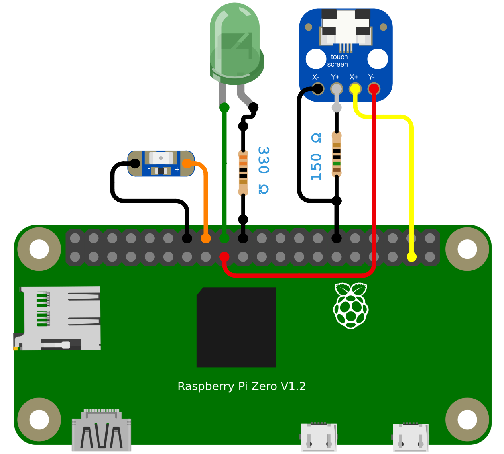

# PiSight

This is an adaptation of [Webcam Pi](https://www.github.com/elcalzado/webcampi) intended to be used alongside some components from the Apple iSight webcam. If you're interested in building this, follow this documentation and my YouTube video!

[](https://www.youtube.com/watch?v=NOTREADY)

## Table of Contents

1. [Required Hardware](#required-hardware)
2. [Features](#features)
3. [Installation](#installation)
4. [Setup](#setup)
5. [Building](#building)
6. [Credits](#credits)

## Required Hardware

| Part                         | Description                         | Buy / Download                                            |
| ---------------------------- | ----------------------------------- | --------------------------------------------------------- |
| Apple iSight                 | The shell for the camera            | [eBay](https://www.ebay.com/sch/i.html?_nkw=apple+isight) |
| Raspberry Pi Zero 2 W        | Main compute module                 | [Adafruit](https://www.adafruit.com/product/5291)         |
| Camera Module 3              | CSI-2 camera module                 | [Adafruit](https://www.adafruit.com/product/5657)         |
| microSD card (≥100 MB)       | System storage                      | [Amazon](https://a.co/d/8l5QlQr)                          |
| USB-C cable                  | USB-OTG data & power                | [Amazon](https://a.co/d/9c4WzDl)                          |
| USB-C female breakout board  | Replaces original micro‑USB port    | [Amazon](https://a.co/d/h6eIS50)                          |
| Touchscreen breakout board   | Shutter (IR sensor) adapter         | [Adafruit](https://www.adafruit.com/product/334)          |
| Resistors (5.6k, 150, 330)   | Shutter sensor + activity/logo LEDs | [Amazon](https://a.co/d/awGgQPf)                          |
| Adafruit Sequin LED          | Optional Apple logo back‑light      | [Adafruit](https://www.adafruit.com/product/1758)         |
| Any soldering iron           | Wire soldering needed               | [Amazon](https://www.amazon.com/s?k=soldering+iron)       |
| Any drill with a 5/64 in bit | For swivel slot hole                | [Amazon](https://www.amazon.com/s?k=drill)                |
| 3D printed parts             | Internal frame + mounting adapters  | [Printables]()                                            |

## Features

PiSight keeps all the core functionality of Webcam Pi while adding hardware integration and quality‑of‑life features specific to the Apple iSight enclosure.

### Added / Changed vs Webcam Pi

- Apple iSight enclosure compatibility
- Lets you retain the original iSight’s tilt and axial twist
- Reused original activity LED
- Optional rear Apple logo illumination
- Integrated IR shutter / privacy sensor
	- For more info about how the sensor works check out: [isight-shutter](https://github.com/elcalzado/isight-shutter)
- USB‑C breakout replaces the original connector area
- Enumerates as a UVC device named “PiSight” (instead of “Webcam Pi”) with an updated manufacturer string

## Installation

1. Download the latest image from the [Releases](https://github.com/elcalzado/pisight/releases) page.
2. Insert your microSD card into your host computer.
3. Flash the image:
	- Linux/macOS:
   ```bash
   # Replace /dev/sdX with your card device
   sudo dd if=pisight-<version>.img of=/dev/sdX
   ```
	- Windows:
   ```
   Use a tool like Balena Etcher or Raspberry Pi Imager
   ```

## Setup



1. Insert the flashed microSD card into the Pi.
2. Assemble the camera (YouTube at the top video shows how I did it).
3. Plug an USB-C cable into the camera and the other end into your host USB port.
4. On your host machine, a new video device should appear.

## Building

### Prerequisites

- Linux host (WSL is fine)
- Git and buildroot dependencies

### Clone

```bash
git clone --recursive https://github.com/elcalzado/pisight.git
cd pisight
```

### Build

```bash
# This will configure Buildroot and compile the kernel, rootfs, and image
./build.sh
```

When complete, the final SD card image will be in:

```
buildroot/output/images/sdcard.img
```

Flash it as described in [Installation](#installation).

## Credits

- [webcampi](https://github.com/elcalzado/webcampi): The embedded linux image from which pisight is derived.
- [original pisight](https://github.com/maxbbraun/pisight): The project that inspired this!
- [isight-shutter](https://github.com/elcalzado/isight-shutter): Brief documentation for the Apple iSight's shutter sensor.
